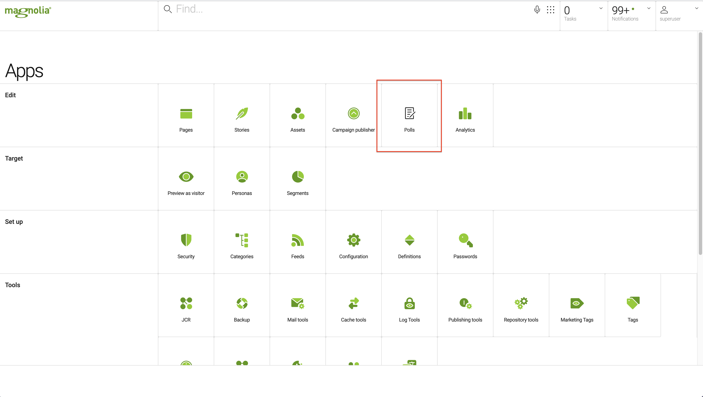
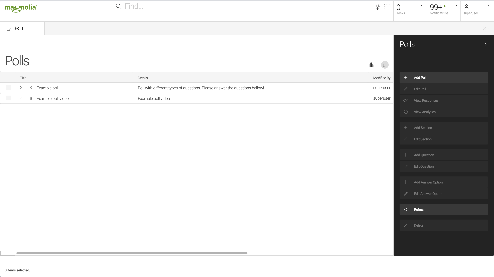
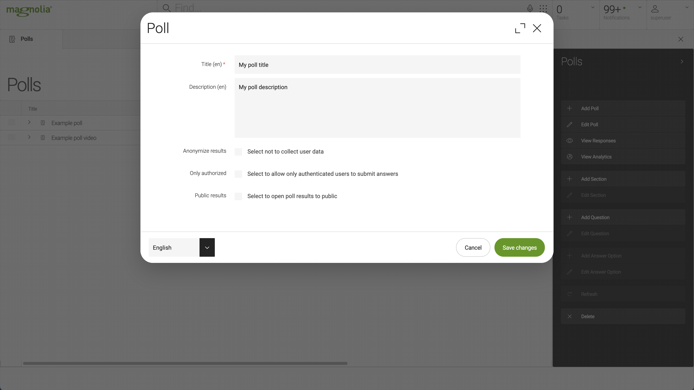
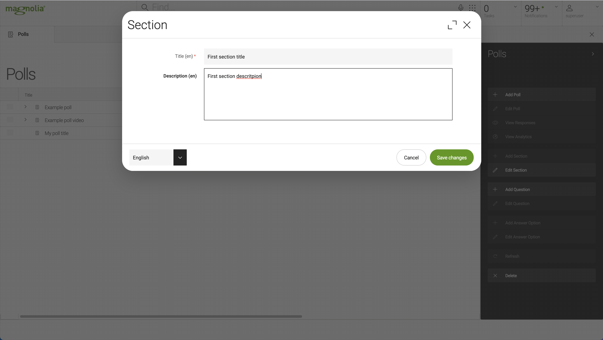
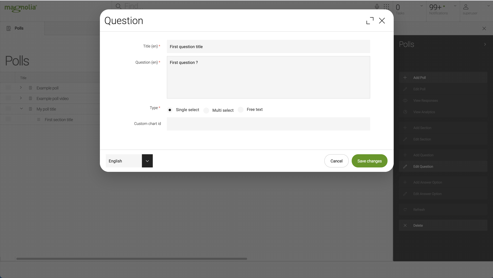
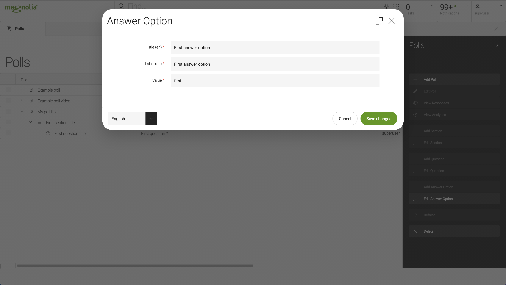
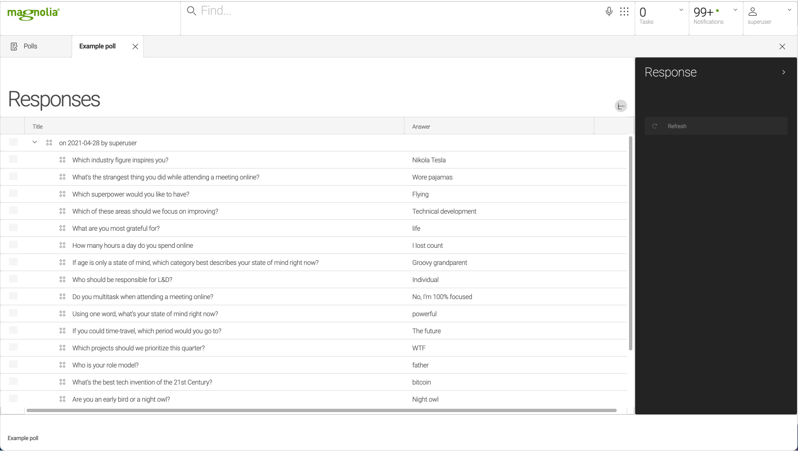
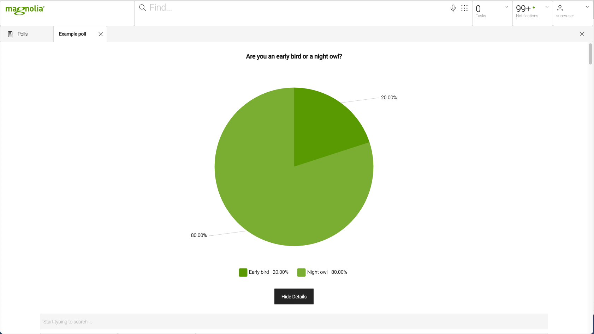
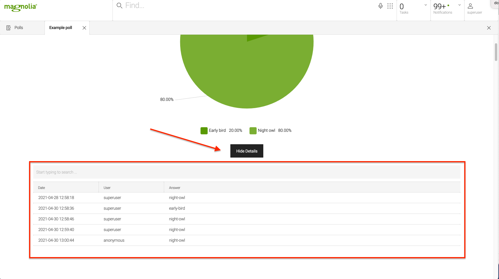

#Content App

##Form CRUD operations

Form module ships with Forms custom content app. 
Application can be accessed through magnolia app chooser:
  

Forms application will be opened.
  

User can manage (Add/Update/Delete) forms through this app.
  

Create form by clicking "Add form" command from the right side menu.
  

When creating a form, besides form title and description there are three additional option fields available:
- Anonymize results
- Only authorized
- Public results

If "Anonymize results" is checked, all form answers will be saved as answered by anonymous user. 
If "Only authorized" is checked, unauthorized users (anonymous) will not be allowed to post form answers. 
If "Public results" is checked, results for this form will be available over rest endpoint. 
  
One form can have multiple sections. 
Add section(s) to form by selecting a form in the grid and clicking "Add section" command from the right side menu.
  

  

One section can have multiple questions. 
Question can be added to section or directly to form (In case there is no need to structure questions in sections).
Add question(s) to section/form by selecting a section/form in the grid and clicking "Add question" command from the right side menu.
  

  

Question can be one of three types:
- Single select
- Multi select
- Free text

If question is of type: Single or Multi select then user should add multiple "Answer options" to this question. 
Add answer option(s) to question by selecting a question in the grid and clicking "Add answer option" command from the right side menu.
  

  

##Form Results

We can view form results by selecting a form in the forms custom content app and clicking on "View results" command from the right side menu. 
Form results sub-app will be open where all form results are listed. Form results are groped by user and date:
  

##Form Analytics

We can view form results in more advanced representation by selecting a form in the forms custom content app and clicking on "View analytics" command from the right side menu. 
Form analytics sub-app will be open where all form results are listed, represented with Chart views:
  

We can view/search answers for each question by clicking on the "Show details" button under the chart/question:
  

Chart type used to represent form results is based on the question type. 
- Single select question is represented with Pie chart by default.
- Multi select question is represented with Bar chart by default.
- For Free text question chart is not generated, only details answer grid is shown in the analytics view.

